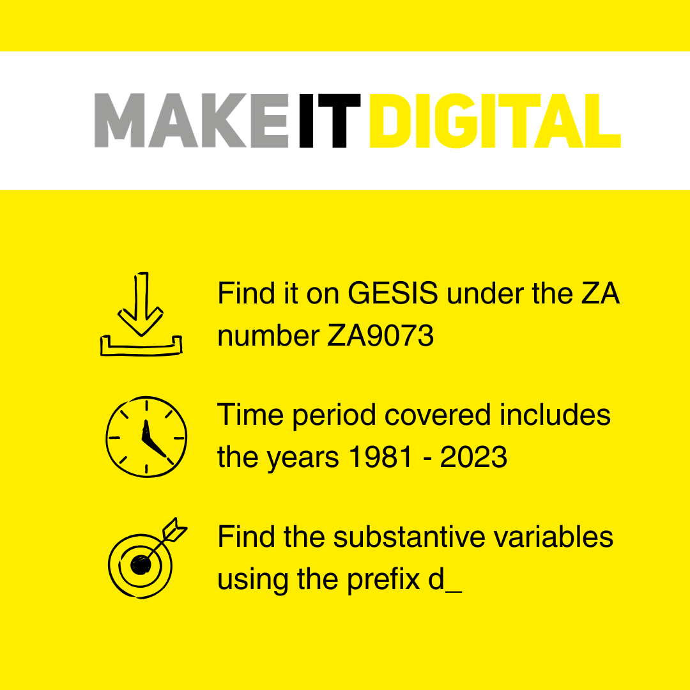
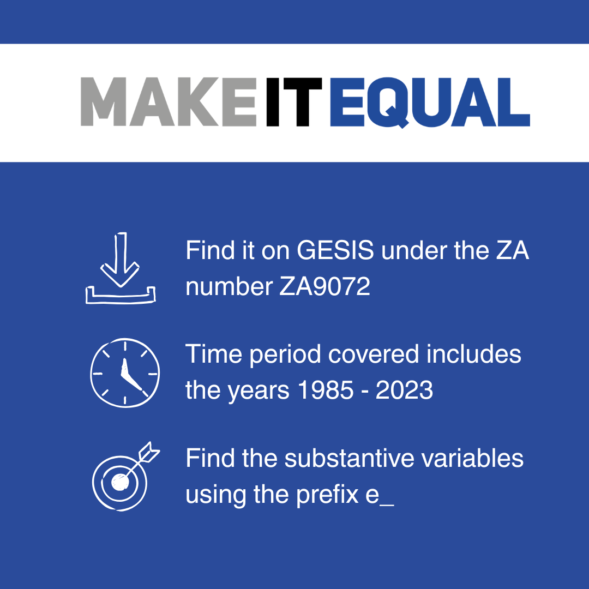
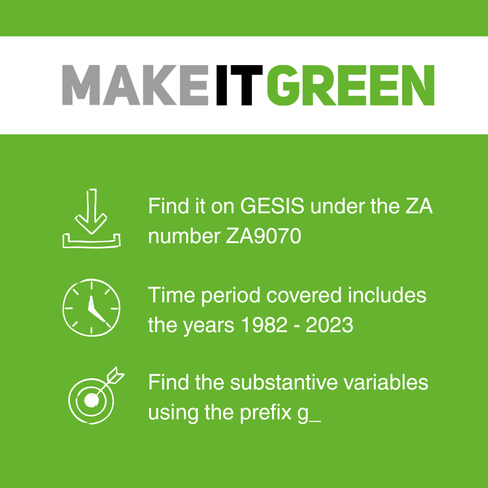
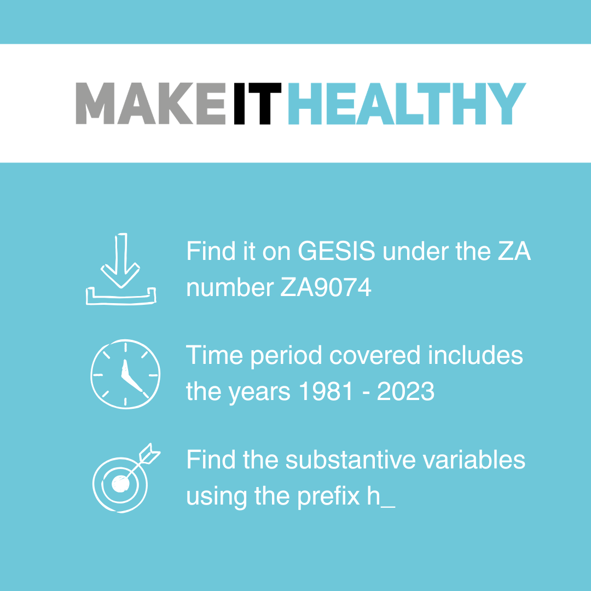
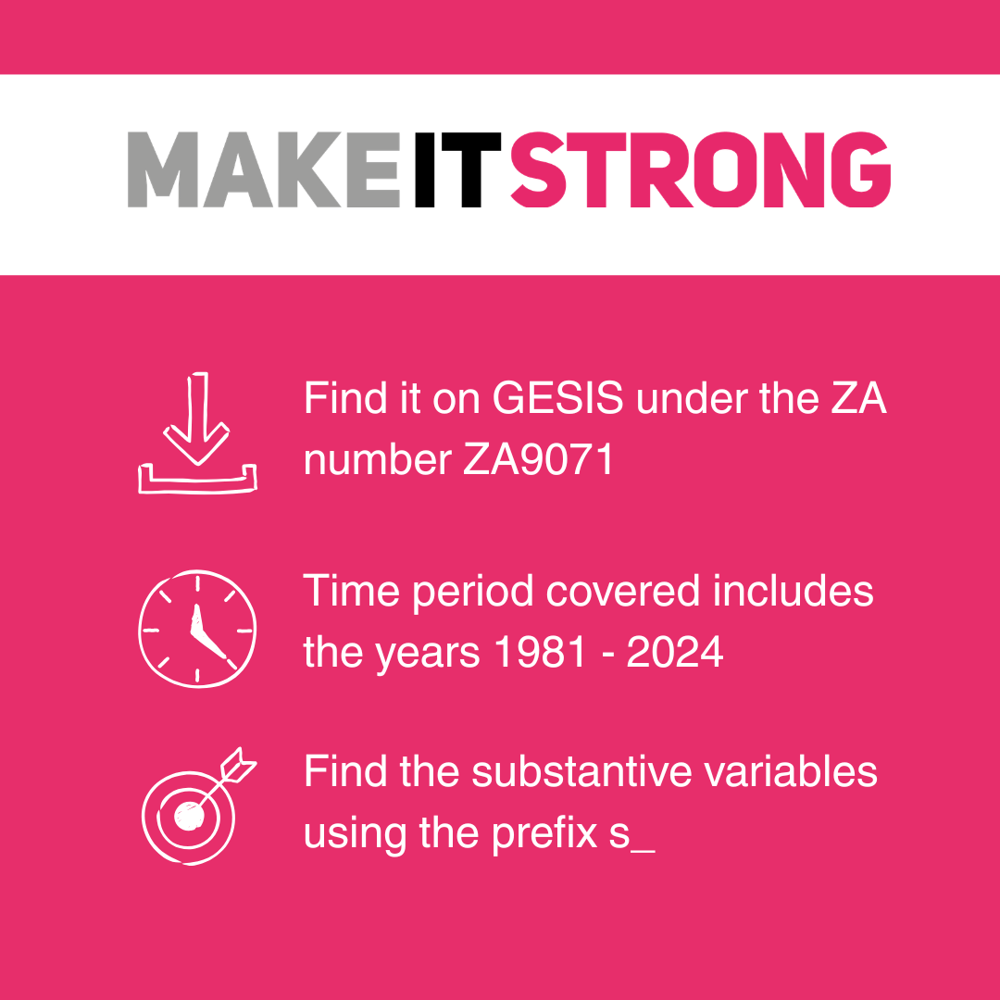

<!--
author: Nidanur Basturk, Insa Bechert, Aleksa Sandkuhl
email: harmonisation.i4ng@gesis.org
version:  1.0.0
narrator: UK English Female
comment:  This course gives an introduction to Creating and Working with Ex-post Harmonised Survey Data. For more information including the suggested citation, please refer to the Readme.md file.
link:     https://cdn.jsdelivr.net/chartist.js/latest/chartist.min.css
script:   https://cdn.jsdelivr.net/chartist.js/latest/chartist.min.js
-->

# Introduction

Welcome to the [Infra4NextGen](https://infra4nextgen.com/) course on Creating and Working with Ex-post Harmonised Survey Data!

This course introduces you to ex-post data harmonisation in cross-national survey research, shows you how to apply harmonisation techniques in your own work, and how to use the NextGen Harmonised Data Gateway for your research purposes. 

We will give you some insights on data harmonisation strategies, explain how to use harmonised cross-national survey data, give you some criteria for the evaluation of the harmonised data for your intended use, and make you familiar with hands-on tools. Our goal is for you to gain theoretical understanding, practical skills, and the ability to evaluate the quality of harmonised measures. 

[Section 1](#4): The NextGen Harmonised Data Gateway 

[Section 2](#8): Foundation of Survey Data Harmonisation 

[Section 3](#12): Working with harmonised datasets 

[Section 4](#15):  Assessing the quality of harmonised measures

[Section 5](#20): Create your own dataset 

[Summary](#24)

Cross-national survey research offers rich insights into social phenomena across diverse populations. However, differences in survey design, question wording, and response scales can make direct comparisons challenging. Ex-post data harmonisation enables you to leverage existing survey data more effectively, enrich your analyses by combining multiple data sources, and contribute to more robust, comparable research. This course will help you enrich your datasets and strengthen your secondary analyses. 

If you want to learn how to work confidently with existing harmonised survey data and/or create your own harmonised datasets, this course is for you! 

<!-- style="background-color: #6EC7D9;"--> 
> It will take about XX minutes to complete this module. 


## Objectives and Learning Outcomes
This course aims to: 
* Explain the theoretical foundations, practical tools, and research goals of survey data harmonisation in cross-national contexts 
* Demonstrate the I4NG Variable Database, Harmonisation Toolbox, and Harmonised Datasets through guided exploration 
* Equip you with frameworks and quality indicators to critically assess the reliability, validity, and comparability of harmonised measures 
* Enable hands-on practice applying harmonisation strategies through guided R scripts and practical tasks 

By the end of the course, you will be able to: 

* Navigate the Variable Database to identify relevant harmonised variables and metadata for your specific research questions 
* Distinguish between key harmonisation strategies and their consequences 
* Evaluate the quality of harmonized data based on reliability, validity, and comparability indicators 
* Navigate the Variable Database to identify relevant harmonised variables and metadata for your specific research questions 
* Apply practical harmonisation tools (Harmony Tool and Harmonisation Toolbox) 
* Frame the survey data harmonisation process, and start executing a research project using harmonised survey data 

<!-- style="background-color: #6EC7D9;"--> 
> **Pre-requisites to the module**
>
> * No prior knowledge of harmonisation strategies is required 
> * Basic familiarity with survey research concepts is helpful but not mandatory 
> * Familiarity with basic statistical concepts (mean, frequency distribution, missing values) is recommended 
> * For the hands-on parts in section 3: The scripts, are written in R, which requires a basic familiarity with the R syntax. However, the scripts can be followed by anyone with advanced knowledge of other script-based statistical software. If you do not have R experience: You should still be able to follow along by reading the detailed code of comments and explanations in the section. - 

<!-- style="background-color: #E72E6B; color: white"--> 
> **A note on knowledge checks and quizzes**
>
> We have added some knowledge checks throughout the course so you can test your knowledge after each section. You will not be graded on these quizzes, but we invite you to take them to check if you understood certain sections. 
> You can get some hints by clicking onto the light bulb icon below each quiz, and reveal the solution by clicking on the checkmark. 

## Office Hours  

This course comes with individual support in different formats. 

1. Individual office hours: Two sessions, each with additional materials, input, and Q&A with the Infra4NextGen Harmonisation team: 
* Session 1: 09.06.2026, 11:00 – 12:30 CEST Kick-off & Meet the Harmony Team, (Harmony is a unique NLP-based tool to accelerate harmonisation processes.). Register via XXX
* Session 2: 29.09.2026, 11:00 – 12:30 CEST Evaluation of Test Equating & Linking Methods for Harmonisation. Register via XXX
2. Public Consultation Slots:  We offer three open Q&A sessions for questions and follow-ups.  Register via XXX 
* Tuesday, 30.06.2026, 11:00 – 11:30 CEST   
* Wednesday, 28.10.2026, 11:00 – 11:30 CET    
* Tuesday, 01.12.2026, 11:00 – 11:30 CET   

If you have any questions, you can always contact the I4NG Harmonisation team at GESIS via email XXXX LINK. 

Ready to dive into the world of survey data harmonization? 

Go ahead to [Section 1 on the NextGen Harmonised Data Gateway](#3)!

----
 

# Section 1: The NextGen Harmonised Data Gateway

In this section, you will explore the three components of the NextGen Harmonised Data Gateway!


* **Variable Database** - Find which surveys asked about your topic 
* **Harmonisation Toolbox** - See how experts harmonised variables (with R code that you can reuse for your own projects) 
* **Harmonised Datasets** - Download ready-to-use data 

Each component includes a video demonstration. 

Note: These videos were created for a general audience, not specifically for this course. 

## 1.1 The Variable Database 

The Variable Database serves as the entry point for harmonisation work.  

The database draws on major cross-national surveys conducted in Europe over the last 40 years, including Eurobarometer, EQLS, ESS, EVS, the Generations and Gender Survey, and ISSP. The measurement instruments from these surveys were carefully assessed for comparability, and more than 1,000 variables were grouped into about 350 concepts across the five EU youth policy pillars: 
* Make it Green 
* Make it Digital 
* Make it Healthy 
* Make it Strong 
* Make it Equal. 

The listed items are potential candidates for harmonisation. 

For each concept that was measured in at least two different survey programmes, the Variable Database provides information and direct links on: 
* The related survey programmes and years 
* Question texts 
* Response categories 

Watch the video below to learn more about the Variable Database and how to use it for your research. 

Video: [insert Video here] 

## 1.2 The Harmonisation Toolbox 

The Harmonisation Toolbox offers examples of how to harmonise specific items. The examples provide: 
* Step-by-step guidance through the harmonisation process 
* Explicit documentation of the harmonisation decisions 
* Ready-to-use R commands 
* Suggestions for subsequent secondary analysis 

The examples are designed so that no prior knowledge of the statistical programming language is required. You can use them to learn more about the harmonisation process or for your own harmonisation projects. Watch the video below to learn more about the Harmonisation Toolbox:

Video: [insert Video here] 

## 1.3 The Harmonised Datasets 

The harmonised datasets are organized by the EU youth policy pillars. In total, they contain 47 selected items which have already been harmonised by the Infra4NextGen team. 

You can also access explicit documentation for each harmonisation process that was conducted as HTML documents directly from the data page here. In the following video, we explain how you can access, navigate, and analyse these datasets to support your research. 

Video: [insert video here] 

<!-- style="background-color: #6EC7D9;"--> 
> In this section you learned about the three tracks of the Harmonised Data Gateway. You probably have an idea about how to use them in your next research process. 
> 
> Ready to learn about harmonisation strategies? 
> 
> Continue to the [next section](#8) on the Foundations of Survey Data Harmonisation section on Harmonisation Strategies and Consequences! 

# Section 2: Foundations of Survey Data Harmonisation

Harmonisation can take place at various stages and levels. In this course, we focus on **ex-post harmonisation at the variable level**, aligning data after it has already been collected. 

In this section, you will learn how survey data from different sources can be made comparable through harmonisation. You learn how to assess whether variables are harmonisable, gain an overview of harmonisation approaches, and understand which strategies can be applied to harmonise response scales. 

## 2.1 Evaluating similarity 

Before applying any method, you must assess similarity. Not all variables can be harmonised; if the underlying concepts are too different, the data cannot be made comparable. 

Watch the video to learn more: 

!?[⏯](video/video1-similarity.mp4)

<!-- style="background-color: #E72E6B; color: white"--> 
> **__Quiz I__**
>
>Which statements about survey data harmonisation are true?  
>
>Click on the lightbulb to get some hints!

<!-- data-randomize -->
-[[X]] Ex-ante harmonisation refers to the process of aligning or standardising rules and regulations within a survey programme before they are implemented or come into effect. 
-[[X]] Ex-post harmonisation is applied after data collection on the output data. 
-[[ ]] We only speak of ex-post harmonisation when we are harmonising variables across different surveys. 
[[?]] There are multiple correct answers. Ex-post harmonization can be used in many contexts.
****
Solution: The first two statements on ex-ante and ex-post harmonisation are true. However, we also speak of ex-post harmonisation when we harmonise national survey data within a single survey to make them truly comparable. This is usually done by data curators before the international data file is published. 
****

<!-- style="background-color: #E72E6B; color: white"--> 
> **__Quiz II__**
>
> When you want to harmonise survey data, which aspects do you need to evaluate regarding their similarity? 
>
> Click on the lightbulb to get some hints! 

<!-- data-randomize -->
-[[X]] The wording of the question texts 
-[[ ]] When the question texts are similar, the response categories do not need to be checked 
-[[X]] Translated question texts 
-[[X]] The cultural context of the country where the question was asked 
[[?]] There are multiple correct answers. 
[[?]] Consider all elements that might affect comparability across datasets.  
****
Solution: When evaluating similarity for harmonisation purposes, you need to consider the wording of question texts and response categories, the response categories even when question texts appear similar, translated question texts, and the cultural context. All these factors can affect data comparability.  
****


## 2.2 Harmonisation strategies 

If variables are sufficiently similar, different strategies can be applied to harmonise response scales. The choice of strategy depends on certain characteristics that are explained in the video below: 

!?[⏯](video/video2-harmonisation-strategies.mp4)

<!-- style="background-color: #E72E6B; color: white"--> 
> **__Quiz III__**
>
>What is the disadvantage of the “Semantic Judgement of the Fixed Word Value” strategy? 
>
>Click on the lightbulb to get some hints! 

<!-- data-randomize -->
-[[X]] The strategy is very expensive when done correctly. 
-[[ ]] The original variables need to be normally distributed. 
-[[ ]] The strategy assumes that word values cannot be given to numeric values on a scale. 
***
Solution: The “Semantic Judgement of the Fixed Word Value” strategy assigned word values to numeric scales. Its disadvantage is that it is very expensive when done correctly. Whether the variable is normally distributed is irrelevant in the process.  
***

<!-- style="background-color: #E72E6B; color: white"--> 
> **__Quiz IV__**
>
>How does the “Linear Stretch” strategy work? 
>
>Click on the lightbulb to get some hints! 

<!-- data-randomize -->
-[[ ]] The scale must always be stretched according to the longest source scale. 
-[[X]] The lowest and highest source scale points are given the lowest and highest values on the target scale, while the remaining scale points are given equally distant values. 
***
Solution: The “Linear Stretch” strategyassigns the extreme scale points of the source scales (lowest and highest) to the extreme values at the target scale, while the remaining categories are given equally spaced values. “Stretching” can be applied by choosing any target scale length.
***

<!-- style="background-color: #E72E6B; color: white"--> 
> **__Quiz V __**
>
>What are the requirements for the “Linear Equating” strategy? 
>
>Click on the lightbulb to get some hints!

<!-- data-randomize -->
-[[ ]] The data definitely needs to be based on the very same samples. 
-[[X]] The data needs to be based on the same population, or better, on the same sample. 
-[[X]] All the original variables need to be normally distributed. 
-[[ ]] The method aligns only the mean value across source variables. 
[[?]] There are multiple correct answers.  
***
Solution: The “Linear Equating” strategy requires that all original variables are normally distributed and that the data is based on the same population or, ideally, the same sample. The method aligns the mean AND the standard deviation.  
***

<!-- style="background-color: #E72E6B; color: white"--> 
> **__Quiz VI__**
>
>When is the “Equipercentile Equating” strategy used? 
>
>Click on the lightbulb to get some hints! 

<!-- data-randomize -->
-[[X]] When the response scale is theoretically the same, but it is used differently across countries. 
-[[ ]] When the scale is not the same. 
***
Solution: The “Equipercentile Equating” strategy is used when the response scale is theoretically the same but is used differently across countries.  
***

<!-- style="background-color: #E72E6B; color: white"--> 
> **__Quiz VII__**
>
>What should you consider when you want to harmonise survey data with different source scales across different populations? 
>
>Click on the lightbulb to get some hints! 

<!-- data-randomize -->
-[[X]] The scales can be aligned by using the Linear Stretch method. 
-[[ ]] You can use the Linear Equating method, but you should add a remark that the data is based on different populations. 
-[[X]] You cannot use the Linear Equating method. 
[[?]] There are multiple correct answers. 
[[?]] Think about which methods absolutely require the same population and what happens when different scales are aligned.  
***
Solution: When harmonising data from different populations, you can use the “Linear Stretch” strategy, but when source and target scale are not the same, you should keep in mind that Linear Strech aligns source and target scales under the assumption that respondents would have answered the very same way, irrespective of which scale was offered. Which we know is not true. However, you cannot use the Linear Equating method because it requires the data to be based on the same population or sample. 
***

In this section, you learned about different harmonisation approaches, how to assess whether survey variables are comparable, and which strategies can be used to harmonise response scales. 

<!-- style="background-color: #6EC7D9;"--> 
>Ready to put theory into practice? 
>
>Go to the [next section](#12) to learn how harmonisation strategies are applied by experts in practice and what this means for data. You will also learn how to access the five I4NG policy pillar datasets, understand the variable naming conventions and documentation, and perform your first cross-pillar analysis in R. 

## 2.3 Bibliography

Roth, M. & Singh, R. K. (2024). Questionlink: Harmonizing single item survey questions on the same construct. https://matroth.github.io/questionlink/ 

De Jonge, T., Veenhoven, R. & Kalmijn, W. (2017). Diversity in Survey Questions on the Same Topic. Springer International Publishing AG. 

Davidov, E., Meuleman, B., Cieciuch, J., Schmidt, P. & Billiet, J. (2014). Measurement Equivalence in Cross-National Research. Annual Review of Sociology, Volume 40, pp. 55-75. 

Granda, P., Wolf, C., & Hadorn, R. (2010). Harmonizing survey data. Survey methods in multinational, multiregional, and multicultural contexts, 315-332. 

Roth, M. & Singh, R. K. (2025). One harmonization fits all? – Impact of missing population invariance on harmonisation error when harmonizing social science survey questions with equating. International Journal of Social Research Methodology. 

Michaud, A., Bosch, O. J. & Sauger, N. (2023). Can Survey Scales Affect What People Report as A Fair Income? Evidence From the Cross-National Probability-Based Online Panel CRONOS. Social Justice Research, Volume 36, pp. 225-262. 

# Section 3: Working with Harmonised Datasets

In this section you will learn 

* How to download data from the GESIS repository, including I4NG harmonised datasets, directly from within your R workflow using the rgesis package 
* Understand the variable structure: substantive vs. background variables 
* Learn how to explore a variable: frequencies, country coverage, year coverage, and source surveys 
* Understand how harmonisation adds value 
* How to merge datasets across policy pillars using the unique respondent ID 

## 3.1 The Five I4NG Datasets 

The I4NG project provides ready-to-use harmonised datasets. Each dataset corresponds to one of the five thematic pillars of EU youth policy.  

Each dataset is identified by a **ZA study number**. This is a unique ID used by the GESIS Data Archive to help you cite the data and locate it quickly. 







In our data page, you will find    
* Data download links  
* Topics that are covered in each pillar 
* Documentation of the datasets 
* Coverage maps per harmonised item and survey 

Please take a moment to have a quick look at [this page](https://infra4nextgen.com/harmonisationgateway/data.html)

**Always Consult the Documentation  **

Before analysing harmonised variables, check the GESIS documentation to understand: 
* **How variables were harmonised** across different source surveys 
* **What each variable measures** and its conceptual definition 
* **Survey-specific notes** and caveats about comparability 
* **Response scales and coding** schemes used 

** Understanding Variable Naming **

Variables are organised into two types: 

* **Substantive variables**: These are the variables you are likely most interested in analysing because they carry substantial content. They always start with the pillar letter so you can distinguish them easily. 
**Format**: Pillar _ Concept _ Label 

 e_ = Equal, d_ = Digital, g_ = Green, h_ = Healthy, s_ = Strong. 

The second part indicates the concept (e.g., wr = Work & Redistribution) and the third part is a short label (e.g., govn = Government Responsibility).  

For example, e_wr_govn reads: pillar **E**qual_ concept **wr** _label **govn**. 

* **Background and protocol variables** are everything else. Background variables describe the respondent and survey context (e.g., caseID_I4NG, country_I4NG, year, mode, w1_design).  Protocol variablesidentify the study (e.g., studyno_I4NG, survey, survey_year_title, doi_I4NG).  

## 3.2 Hands-On

This section will show you how to access and work with I4NG harmonised datasets for your research.  It includes **R code** designed for hands-on exercises with the I4NG datasets. If you are not an R-user: You can still follow along! We have commented on the code chunks. By reading the comments (text starting with #) and further explanations, you should be able to understand the logic of data processing.  

**Setting Up Your Environment**
To access the datasets, you need a free GESIS account. Create on at the [GESIS log in page](https://login.gesis.org).  

If you want to run the code locally, you need two free software programs:  Install [R](https://www.r-project.org/) and [RStudio](https://www.rstudio.com/) 

**New to R?** If you need further guidance, we suggest [R for Non-Programmers](https://r4np.com/) that also includes a detailed section on how to set up R and R studio.

You have two ways to interact with the exercises: 
* Copy & Paste: You can click the Copy icon on the right-hand side of any code chunk in this course to paste it directly into your RStudio script. 
* Download the Full Script: If you prefer to have the complete code for this entire section, you can [Download the R Script Here](Section3_WorkingwithHarmonisedData.Rmd). 


** 3.2.1 Setup: Install and Load Packages **

If you are an R user, we suggest you run the code in your own session in your local environment.  First, run the installation lines once only. Then load the packages at the start of every R  session. 
``` r
# --- ONE-TIME SETUP --- 
# Only run these if you have not installed them yet 
 
# install.packages("pak") 
# pak::pkg_install("jslth/rgesis")   # rgesis from GitHub 
# install.packages(c("haven", "dplyr", "labelled", "tidyr")) 

# --- LOAD PACKAGES (run every session) --- 
library(rgesis)    # Download data directly from GESIS 
library(haven)   # Read SPSS (.sav) files 
library(dplyr)     # Data manipulation 
library(labelled) # Work with variable labels 
library(tidyr)     # pivot_wider for coverage matrices 
```

What does each package do? 
* rgesis: connects to GESIS and downloads datasets directly from R 
* haven: reads SPSS .sav files and preserves variable labels 
* dplyr: provides filter(), count(), select(), summarise(), and more 
* labelled: lets you inspect variable labels from SPSS files with var_label() 
* tidyr : lets you reshape data 

** 3.2.2 Authenticate with GESIS  **  

* The rgesis package handles authentication automatically via your browser 

``` r
# Opens a browser window for you to log in  
gesis_auth() 
``` 

**Note:** When successful, you will see: Successfully performed GESIS login. The rgesis package handles authentication automatically via your browser. You do not need to manage tokens manually. 

** 3.2.3 Download Your First Dataset **

Now, let us download your first dataset. Remember the ZA numbers from the datasets table? These are ID numbers that uniquely identify datasets in the repository and allow you to download them directly from R. We will use the Make it Equal dataset (ZA9072) for our first working example. 

``` r
# Download the SPSS version of the Equal dataset from GESIS 
I4NG_equal_file <- gesis_data("ZA9072", select = "\\") 

#When you run gesis_data(), R will ask you to specify the purpose of your data use: 
#ℹ Please specify a purpose for the use of the research data. 
 
1: for final thesis of the study programme (e.g. Bachelor/Master thesis) 
2: for research with a commercial mission 
3: for non-scientific purposes 
4: for further education and qualification 
5: for scientific research (incl. doctorate) 
6: in the course of my studies 
7: in a course as a lecturer 
   
#Type the number that best matches your purpose and press Enter. 

# user_na = TRUE tells R to treat SPSS missing value codes (-9, -99, -999) as NA.  

# This means  !is.na() will automatically exclude all three types later in your analysis. 
I4NG_equal_data <- read_sav(I4NG_equal_file, user_na = TRUE) 
 
# How big is it? 

# It is always good practice to check the size of your dataset after loading it. 

 # The first number is the number of rows (respondents), and the second is the number of columns (variables).  
dim(I4NG_equal_data)
```

**What just happened? **

When you run gesis_data(). 
* gesis_data() connected to GESIS and downloaded the SPSS file for ZA9072 
* read_sav() loaded it into R as a data frame, preserving all variable and value labels 
* dim() tells you: rows = respondents, columns = variables 

**3.2.4 Explore the Variable Structure **

Before doing any analysis, let us explore  the contents of the dataset. It helps to understand the data structure and which variables are available. 

``` r
# View All Variables and Their Labels 

#  Quick named list of all variable labels 
var_label(I4NG_equal_data) 

# Detailed table: variable name + label + type + missing count 

#It creates a summary table showing:  

# - The variable name  

# - The descriptive label (the question asked 

 # - The data type (e.g., numeric or factor) 

 # - The count of missing values (NA) 

detailed_table <- data.frame( 
   variable  = names(I4NG_equal_data), 
   label     = sapply(I4NG_equal_data, function(x) attr(x, "label")), 
   type      = sapply(I4NG_equal_data, function(x) class(x)[1]), 
   n_missing = sapply(I4NG_equal_data, function(x) sum(is.na(x))) 
) 
  
# View the summary table 

print(detailed_table) 
```

**Identify Substantive vs. Background Variables ** 

Remember the two variable types in the dataset? Here is where you see how many of each exist in your dataset. Substantive variables are the items you will most likely analyse, and running this code tells you at a glance how much content the pillar covers. Background and protocol variables matter too, as knowing which are available tells you how to contextualise your results and their sources. 

``` r
all_vars <- names(I4NG_equal_data) 
 
# Substantive harmonised variables (start with "e_") 
substantive_vars <- all_vars[grepl("^e_", all_vars)] 
print(paste("Number of substantive variables:", length(substantive_vars))) 
print(substantive_vars) 
 
# Background and protocol variables (everything else) 
back_prot_vars <- all_vars[!grepl("^e_", all_vars)] 
print(paste("Number of background/protocol variables:", length(back_prot_vars))) 
head(back_prot_vars, 20) 
```

**3.2.5 The Unique Respondent ID: caseID_I4NG **

**The Key to Cross-Pillar Analysis **

caseID_I4NG is the unique respondent identifier that is **consistent across all five datasets**. This is the variable you can use to merge data from different policy pillars. Each respondent has the same ID across all five datasets. 

``` r
# Preview the respondent ID 
I4NG_equal_data %>% 
   select(caseID_I4NG) %>% 
   head(10) 
 
# Check whether IDs are truly unique (they should be) 
I4NG_equal_data %>% 
   summarise( 
     total_rows     = n(), 
     unique_ids     = n_distinct(caseID_I4NG), 
     ids_are_unique = n() == n_distinct(caseID_I4NG) 
   ) 
```

** 3.2.6 Explore One Variable in Detail **

We will use e_wr_govn (Government Responsibility in Income Redistribution) as our example variable throughout this section. 

[Here](https://infra4nextgen.com/harmonisationgateway/documentation_equal.html#government-responsibility-in-income-redistribution---e_wr_govn) is where you can see  the documentation for this variable, including   question text, response scales, harmonisation decisions, and more. 

**Missing Value Codes **

I4NG datasets use standardised missing value codes. Always filter these out before any content-related analysis: 
*   -9 = Missing from source datasets 
* -99 = Not applicable for this item 
* -999 = Inapplicable from source datasets 

Because we loaded the data with user_na = TRUE, these are already stored as tagged NAs, so !is.na() is sufficient to exclude them all. 

**Frequencies **

Start with the overall distribution across all surveys and countries combined. 
``` r
# Check raw values first  including missing codes 
I4NG_equal_data %>%  
count(e_wr_govn) 
```
  
What do you see here? The variable has both valid responses (1–5 scale) and missing value codes: -9, -99, -999. Also note the values 2.333… and 3.666…  these are harmonised intermediate values produced by the linear stretch method when a source scale was mapped onto the 1–5 target scale. This is a direct result of the harmonisation.  

``` r
# Overall frequency table 
I4NG_equal_data %>% 

#  Remove "NA" (missing) values. 
   filter(!is.na(e_wr_govn)) %>% 

#Count how many people chose each answer (e.g., how many said '1'). 
   count(e_wr_govn) %>% 

# A new column ('pct') to show the relative share.  

# Round to 1 decimal place (e.g., 25.4%) for readability. 
   mutate(pct = round(n / sum(n) * 100, 1)) %>% 
# Sort: Organize the table by the answer code 

  arrange(e_wr_govn)  
```

You can filter missing codes if you are merely interested in the content-related variables. Because we used user_na = TRUE, !is.na() handles all three of missing values (-9, -99, -999) at once.  

**Which Source Surveys Cover This Variable? **

The harmonised data pools from multiple original surveys. 
``` r
# How many source surveys and respondents in total? 
I4NG_equal_data %>% 
   summarise( 
     n_survey_year_titles = n_distinct(survey_year_title), 
     n_surveys            = n_distinct(survey), 
     n_years              = n_distinct(year), 
     total_respondents    = n() 
   ) 

# Which surveys have valid data for e_wr_govn, and how many respondents? 
I4NG_equal_data %>% 
   filter(!is.na(e_wr_govn)) %>% 
   count(survey_year_title) %>% 
   arrange(desc(n)) 
```

**Frequencies Split by Survey **
```r
I4NG_equal_data %>% 
   filter(!is.na(e_wr_govn)) %>% 
   group_by(survey_year_title) %>% 
   count(e_wr_govn) %>% 
   mutate(pct = round(n / sum(n) * 100, 1)) %>% 
   arrange(survey_year_title, e_wr_govn) 

Country Coverage for This Variable 

# How many unique countries have valid data for e_wr_govn? 
I4NG_equal_data %>% 
   filter(!is.na(e_wr_govn)) %>% 
   summarise(n_countries = n_distinct(country_I4NG)) 
 
# N per country 
I4NG_equal_data %>% 
   filter(!is.na(e_wr_govn)) %>% 
   count(country_I4NG) %>% 
   arrange(desc(n)) 
 
# How many unique countries per source survey? 
I4NG_equal_data %>% 
   filter(!is.na(e_wr_govn)) %>% 
   group_by(survey_year_title) %>% 
   summarise(n_countries = n_distinct(country_I4NG)) %>% 
   arrange(desc(n_countries)) 
```
**Country × Year Coverage Matrix **

```r
This shows which countries are available in which years. 

I4NG_equal_data %>% 
   filter(!is.na(e_wr_govn)) %>% 
   count(country_I4NG, year) %>% 
   tidyr::pivot_wider( 
     names_from  = year, 
     values_from = n, 
     values_fill = 0 
   ) 
```

**What to look for in these outputs **
* Are there surveys that only cover certain years? This is normal, different programmes run at various times. 
* Are some cells -999? That means no respondents from that country answered this item in that year. 

  
** 3.2.7 Coverage Across Surveys, Countries and Time **

So far, we have been working with the Equal dataset and one variable. Now, examine what the Green dataset looks like, specifically how many surveys, countries, and years contribute to a given variable, and how that compares to using any single source survey on its own. 

We use g_ep_clai (“Many claims about the environment are exaggerated”) for our example. 

```r
# Download the Green dataset 
I4NG_green_file <- gesis_data("ZA9070", select = "\\") 
I4NG_green_data <- read_sav(I4NG_green_file, user_na = TRUE) 
```  

Now, let us find which single survey has the most respondents for this variable. By 'best,' we mean the survey with the largest sample size (highest N) for g_ep_clai. We will then compare this single survey's coverage against the combined harmonised dataset to show you the real power of pooling data across multiple surveys. 

```r
# --- The single best survey --- 
I4NG_green_data %>% 
   filter(!is.na(g_ep_clai)) %>% 
   count(survey_year_title) %>% 
   arrange(desc(n)) %>% 
   head(1) 
 
# --- Countries per survey --- 
I4NG_green_data %>% 
   filter(!is.na(g_ep_clai)) %>% 
   group_by(survey_year_title) %>% 
   summarise(n_countries = n_distinct(country_I4NG)) %>% 
   arrange(desc(n_countries)) 
 
# Total country coverage 
I4NG_green_data %>% 
   filter(!is.na(g_ep_clai)) %>% 
   summarise(n_countries = n_distinct(country_I4NG)) 
 
# --- The harmonised total --- 
I4NG_green_data %>% 
   filter(!is.na(g_ep_clai)) %>% 
   summarise( 
     total_n     = n(), 
     n_countries = n_distinct(country_I4NG), 
     n_years     = n_distinct(year), 
     n_surveys   = n_distinct(survey_year_title) 
   ) 
```

**What to look for **

Compare the largest single survey’s N and country count against the harmonised totals. You will typically find that no single source survey covers as many countries, years, or respondents as the combined dataset. This is the practical consequence of pooling across programmes by harmonisation: broader coverage, at the cost of having to account for source heterogeneity in your analysis (which is what Section 4 is about).  

What happens when you want to analyse two variables from different policy pillars? This is where the caseID_I4NG becomes crucial. Let us see how to merge datasets and what trade-offs you will encounter.

** 3.2.8 Merging Datasets Across Pillars **

Explore a Variable from the Green Dataset 

Before merging, let us explore g_ep_clai the same way we did for e_wr_govn. 
```r
# Overall frequencies for g_ep_clai  
I4NG_green_data %>% 
   filter(!is.na(g_ep_clai)) %>% 
   count(g_ep_clai) %>% 
   mutate(pct = round(n / sum(n) * 100, 1)) %>% 
   arrange(g_ep_clai) 
 
# Frequencies split by survey 
I4NG_green_data %>% 
   filter(!is.na(g_ep_clai)) %>% 
   group_by(survey_year_title) %>% 
   count(g_ep_clai) %>% 
   mutate(pct = round(n / sum(n) * 100, 1)) %>% 
   arrange(survey_year_title, g_ep_clai) 
```
**Who Answered Both Items g_ep_clai and e_wr_govn? **

The code below identifies respondents who provided valid responses to both items. It selects the ID and variable from each dataset, joins them on the shared caseID_I4NG identifier, and drops anyone with a missing value for either item. 

```r
 #  Find caseIDs with valid responses to BOTH variables 
valid_ids <- I4NG_equal_data %>% 
   select(caseID_I4NG, e_wr_govn) %>% 
   inner_join( 
     I4NG_green_data %>% select(caseID_I4NG, g_ep_clai), 
     by = "caseID_I4NG" 
   ) %>% 
   filter(!is.na(e_wr_govn), !is.na(g_ep_clai)) %>% 
   pull(caseID_I4NG) 
 
# How many respondents answered BOTH? 
length(valid_ids) 
```
 
**What you should see **

The number of respondents who answered both items is substantially smaller than the total number of each of the  individual datasets. With the code below, checking which surveys those respondents come from confirms this directly. 

```r
# Which surveys do these respondents come from? 
I4NG_equal_data %>% 
   filter(caseID_I4NG %in% valid_ids) %>% 
   count(survey_year_title) %>% 
   arrange(desc(n)) 
 
# How many unique surveys contributed to the overlap? 
I4NG_equal_data %>% 
   filter(caseID_I4NG %in% valid_ids) %>% 
   summarise(unique_surveys = n_distinct(survey_year_title)) 
```

This is the core trade-off: **individual-level** analysis is possible but comes at the cost of a much smaller sample, limited to surveys that include both items.  

Now, let us put it all together. You have explored individual variables and understood the trade-offs in coverage. Here is how to merge data from different pillars using the caseID_I4NG identifier. You can **reliably** merge these datasets because the caseID_I4NG   identifier ensures that you are matching the same individuals across different datasets. 

** 3.2.9 Merge two datasets: Append a Variable from the Green into the Equal Dataset **

Once you have decided on your analysis, you can merge the g_ep_clai  variable  from the Green dataset into the Equal dataset using caseID_I4NG. All Equal rows are retained; matching respondents get the g_ep_clai  value, others get NA. 

```r
# Append g_ep_clai from Green into the Equal dataset 
I4NG_equal_data <- I4NG_equal_data %>% 
   left_join( 
     I4NG_green_data %>% select(caseID_I4NG, g_ep_clai), 
     by = "caseID_I4NG" 
   ) 
 
# Verify: g_ep_clai is now in the Equal dataset 
I4NG_equal_data %>% 
   select(caseID_I4NG, e_wr_govn, g_ep_clai) %>% 
   head(10) 
 
# Check: how many rows now have valid values for both? 
I4NG_equal_data %>% 
   filter(!is.na(e_wr_govn), !is.na(g_ep_clai)) %>% 
   nrow() 
```
  

**3.2.10 Take-home Exercise **

Try the following on your own. Use the **Strong**  (ZA9071) and the **Digital** datasets (ZA9073). 

1. Download both datasets using gesis_data() 
2. Identify substantive harmonised variables. 
3. Pick one variable from each dataset. Consult the documentation before starting the analysis. Check: overall frequency, source survey coverage, country coverage, year coverage. 
4. Find how many respondents answered both of your chosen variables. 
5. Which specific surveys (e.g., ESS 2016, Eurobarometer 2020) contributed to this overlap? 
6. Append your chosen Strong variable to the Digital dataset so you can analyse them together in one data frame 

```
# Your code here:  

#--- Step 1: Download both datasets --- 

I4NG_strong_file <- gesis_data("ZA9071", select = "\.sav")  

I4NG_strong_data <- read_sav(I4NG_strong_file, user_na = TRUE) 

I4NG_digital_file <-  

I4NG_digital_data <- 

#--- Step 2: Identify substantive harmonised variables --- 

#Hint: Strong variables start with "s_", Digital with "d_" 


#--- Step 3: Pick one variable from each dataset and explore it --- 

#Replace s_your_variable and d_your_variable with your chosen variables 

#Consult the documentation before starting: https://infra4nextgen.com/harmonisationgateway/data.html 


#Overall frequency 


#Source survey coverage 


#Country coverage 


#Year coverage 


#--- Step 4: Find respondents who answered BOTH variables --- 

#Hint: use inner_join() on caseID_I4NG, then filter out NAs on both variables  

#--- Step 5: Append your Strong variable to the Digital dataset --- 

Hint: use left_join() on caseID_I4NG, the same way as in Section 3.9 

```

<!-- style="background-color: #6EC7D9;"--> 
> Section 3 Summary 
>
>You now know how to: 
> * Install, load packages, and authenticate with GESIS 
> * Download I4NG harmonised datasets directly in R 
> * Distinguish substantive from background and protocol variables 
> * Explore a variable: frequencies overall, by survey, by country, by year 
> * Understand which source surveys contribute to each variable 
> * Use caseID_I4NG to merge data across policy pillars 
> 
>  Ready to move on? Go to [Section 4](#XX) to learn how to assess the quality of harmonised measures and understand the consequences of choosing certain harmonisation strategies for the data. 


# Section 4: Assessing the Quality of Harmonised Measures

It is difficult enough to ensure the comparability of international survey data collected at the same time, within the same survey programme, and using the same standardisation rules. This makes it all the more difficult to draw conclusions about how comparable data from different countries, different survey programs, and different points in time really are. Of course, there are methods in international comparative survey research for testing the comparability of data across groups (e.g. MGCFA and IRT). However, these tests usually require several variables measuring the same construct. They cannot be applied to single variables. Nevertheless, there are indicators that clarify the nature of the harmonised data and highlight its strengths and weaknesses. 

## 4.1. The Three Paradigms of Harmonised Data Quality 

Assessing quality can be categorised into three primary aspects that come into consideration at different stages of the harmonisation process: Process Quality, Documentation Quality, and Output Quality. 

A. Assessing Process Quality: Comparability, Reliability and Completeness 
* **Comparability**: The central issue for survey data harmonisation is the comparability of question texts and response categories. The measurement of comparability should be standardised, for example, by using an AI-based software tool that provides standardised comparability indicators, such as HARMONY (see [Section 5](#XX)). 
* **Reliability in terms of Data Consistency**: Checking consistency means controlling the source data for systematic derivations (e.g. missing categories or deviant distributions due to accidentally revised response scales). 
* **Completeness**: Beyond looking at the descriptive statistics for consistency, the data needs to be controlled for completeness. This means it needs to be checked whether all included samples are based on the same universe of the representative sample, which is not the case when, for some samples (maybe in one of three surveys), some respondents were filtered out. Example: All respondents were asked whether they attend religious services, vs only those who report that they are 1) Christians and 2) they believe in God were asked. 

B. Documentation and Transparency  
* **The “Black Box” Challenge**: Without detailed documentation, harmonisation becomes a “black box.” A high-quality process must document whether the harmonised source variables measure the same theoretical concept and which harmonisation decisions were made. 
* **Traceability**: The documentation must link the harmonised variables to the source questionnaire items and the individual survey programme’s documentation. 

C. Assessing Output Quality 
* **Validity in terms of Loss of Information**: This looks at the trade-off between data validity and country or time coverage and should be assessed during the harmonisation process and again on the final output. Researchers must often choose between creating a highly valid harmonised variable that includes only a few countries and applying a “lowest common denominator” approach that covers more countries and/or more time points. The trade-off lies between balancing accuracy (with the possible cost of a small sample) against a large sample (with the cost of possible **aggregation error**). We speak of aggregation error when the harmonised variable becomes so broad that it loses its “predictive power”. If information loss varies significantly between countries, cross-national comparisons of regression estimates become invalid. If the database allows, the degree of aggregation error can be assessed by comparing correlation values between the source and harmonised data using a reference variable. It might also be an option to compare the distributions of harmonised variables with external sources, such as national censuses (if the subject allows it). Major discrepancies might indicate deviations in the source data or a failure in the harmonisation process. Based on these test results, individual harmonisation decisions may need to be reconsidered and revised. 

 

## 4.2 Quality Assurance Checklist 

To ensure that your harmonisation project meets the scientific standards discussed in the previous section, use this practical checklist as a roadmap.  

**Process Quality** 

-[ ]**Source Accessibility**: Are the original data, national questionnaires, and data documentation materials accessible? 
-[ ]**Comparability of question texts and response categories**: Have you selected your source variables according to a standardised procedure that evaluates the level of comparability?  
-[ ]**Crosswalk Table**: Is there a clear “bridge” or mapping document that links original country-specific variables to the final target variable?  

**Documentation & Transparency **

-[ ]**Missing Value and Deviations Audit**: Have you documented why certain cases or countries were excluded? (Distinguish between “Not Applicable” and “Missing Data”). Have you documented measurement deviations among source datasets? 
-[ ]**The “Black Box” Prevention**: Does the final report include a “Recoding Syntax” or a detailed description of every transformation made to the data? 
-[ ]**Report Comparability Indicator**: Do you have the option to report the comparability indicators, which may be self-assigned or provided by a software tool, such as Harmony? 

**Output Quality **

-[ ]**Internal Validity check**: Have you run frequency distributions for all countries? Do the frequency distributions correspond to the source data in the intended way after having applied the harmonisation method?  
-[ ]**External Validation**: Have you compared the harmonised survey means/distributions against the source data or an external source (e.g., National Census data)?  
-[ ]**Aggregation Error Analysis**: Have you calculated the explanatory power of the source variables with the harmonised variable using a reference variable for correlations?  

## 4.3 Check your understanding
<!-- style="background-color: #E72E6B; color: white"--> 
> **__Quiz VIII__**
>
>Which of the following best describes the “Black Box” challenge in harmonisation? 
>
>Click on the lightbulb to get some hints! 

<!-- data-randomize -->
-[[ ]] Using too many statistical variables in a single regression. 
-[[X]] The lack of documentation showing how source data was transformed into target variables. 
-[[ ]] A software error that occurs during ex-post harmonisation. 
-[[ ]] The intentional hiding of sensitive data. 
[[?]] Consider transparency and traceability throughout the workflow.  
*** 
Solution: The “Black Box” challenge in harmonisation is a lack of documentation showing how source data are transformed into target variables.  
***
 
<!-- style="background-color: #E72E6B; color: white"--> 
> **__Quiz IX__**
>
>What is “Aggregation Error” primarily concerned with? 
>
>Click on the lightbulb to get some hints! 

<!-- data-randomize -->
-[[X]] The loss of predictive power when grouping categories or clustering values. 
-[[ ]] Errors caused by poor translation of survey questions. 
-[[ ]] The total number of participants who dropped out of the survey. 
[[?]] It relates to how much information is “lost” during the aggregation process.  
***
Solution: Aggregation Error occurs when detailed data (e.g., specific educational degrees) is aggregated into broad categories (e.g., “High/Medium/Low education”), potentially weakening the statistical relationships in your model.  
***

<!-- style="background-color: #6EC7D9;"--> 
> Summary
>
>Survey data harmonisation is always a trade-off between accuracy and coverage. All harmonisation steps should be carried out and documented with great care. What you should keep in mind during quality checks, though, is that the accepted level of data quality is closely related to the intended use of the target variable! If you want to make broad statements about as many country trends as possible, you can probably tolerate a coarser harmonisation than if you are interested in the differences in precise gradations. 

## 4.4 Bibliography and further reading

**Bibliography **

Heizmann, B. (2025). Good enough? A comparison of different harmonisation procedures and their substantive consequences using the example of life satisfaction. Quality & Quantity. https://doi.org/10.1007/s11135-025-02060-7 

Wolf, C., Schneider, S. L., Behr, D. & Joye, D. (2016). Harmonising Survey Questions Between Cultures and Over Time. In Wolf, C., Joye, D., Smith, T. W. & Fu, Y-u. (eds.). The SAGE Handbook of Survey Methodology. Sage Publications, Los Angeles, pp. 500-522. https://doi.org/10.4135/9781473957893.n33 

**Further Reading **

Bechert, I., Beck, K., & Solanes Ros, I. (2025). Caring for Data’s Soul: The development of a Curation Impact Factor to pinpoint the effects of data curation activities on data quality. International Journal of Digital Curation, 19(1), 1-21. https://doi.org/10.2218/ijdc.v19i1.1030 

 
Biolcati, F., Molteni, F., Quandt, M. & Vezzoni, C. (2020). Church Attendance and Religious change Pooled European dataset (CARPE): a survey harmonization project for the comparative analysis of long-term trends in individual religiosity. Quality & Quantity, Volume 56, pp. 1729-1753. https://doi.org/10.1007/s11135-020-01048-9 

Kołczyńska, M. & Schoene, M. (2018). Survey Data Harmonisation and the Quality of Data Documentation in Cross-national Surveys. Advances in Comparative Survey Methods. 

Kołczyńska, M. & Slomczynski, K. M. (2018). Item Metadata as Controls for Ex Post Harmonisation of International Survey Projects. In Johnson, T. P., Penell, B.-E., Stoop, I. A. L. & Dorer, B. (Eds.). Advances in Comparative Survey Methods: Multinational, Multiregional, and Multicultural Contexts (3MC). Chapter 46. John Wiley & Sons, Inc. https://doi.org/10.1002/9781118884997.ch46 

Huang, C. A. (2024). A Unified Statistical And Computational Framework For Ex-Post Harmonisation Of Aggregate Statistics. arXiv. https://doi.org/10.48550/arXiv.2406.14163 

Jović, M., Haeri, M.A., Whitehouse, A. & van den Berg, S.M. (2024). Harmonizing the CBCL and SDQ ADHD scores by using linear equating, kernel equating, item response theory and machine learning methods. Frontiers in Psychology, Volume 15. 

Slomczynski, K.M., Tomescu-Dubrow, I. & Wysmułek, I. (2021). Survey Data Quality in Analyzing Harmonized Indicators of Protest Behavior: A Survey Data Recycling Approach. American Behavioral Scientist, Volume 66, pp. 412 - 433. 

Tu, Y., Li, O., Wang, J., Shen, H., Powałko, P., Tomescu-Dubrow, I., Slomczynski, K.M., Blanas, S. & Jenkins, J.C. (2022). SDRQuerier: A Visual Querying Framework for Cross-National Survey Data Recycling. IEEE Transactions on Visualization and Computer Graphics, Volume 29, pp. 2862-2874. 

# Section 5: Create Your Own Dataset 

In Section 1, you explored the three components of the Harmonisation Gateway: the Variable Database, the Harmonisation Toolbox, and the Harmonised Datasets. In Section 2, you learned how harmonisation strategies work and what trade-offs they involve. In Section 3, you worked hands-on with the ready-made I4NG datasets. In Section 4, you learned how to assess whether a harmonised measure is good enough for your research purpose. 

You have seen how experts harmonise data at the Infra4NextGen project. Now is the time to apply that knowledge to your own research. Depending on your research goals, you might use some of these components and not others, or you might use them in a modified form. This section helps you identify which pathway fits your project and take your first concrete steps along it. We also introduce one additional tool, the Harmony Tool, which is particularly useful if you want to start from scratch, like we did when building the Variable Database. 

## 5.1 The Three Pathways 

** 5.1.1 Pathway 1: Using Pre-Harmonised I4NG Data **

Use this if: You want to start your analysis immediately using Infra4NextGen’s high-quality harmonised data. 1. **Download**: Access the final harmonised datasets directly. 2. **Verify**: Consult the Documentation to understand the source items and the specific harmonisation decisions we made. 3. **Audit**: If you want to trace the harmonisation decisions step by step (for selected items), look at the **Harmonisation Toolbox** R scripts. 

** 5.1.2 Pathway 2: Harmonising Your Own Data **

Use this if: You found variables in the **Variable Database (VD)** that the I4NG team has not yet harmonised and you want to do it yourself, or you want to re-harmonise an existing I4NG variable using a different strategy. 1. **Select**: Find your ingredients (survey items) in the Variable Database. 2. **Recycle**: Adapt the code from the Harmonisation Toolbox. 3. **Execute**: Replace our data sources with yours, apply the logic of our harmonisation scripts and keep in mind the Quality Checks you learned about in this course. 

** 5.1.3 Pathway 3: Finding New Candidates with the Harmony Tool **

Use this if: Your topic is not covered in our **Variable Database (VD)** and you need to find similar questions across a massive pool of PDFs or codebooks. 1. **Discover**: Use the Harmony Tool to scan your documents. Its Natural Language Processing algorithm will find semantically similar questions to build your own “pool” of items. 2. **Map**: Create your own version of a Variable Database based on the Harmony similarity scores. 3. **Build**: Once your items are identified, apply the harmonisation logic and quality assessments to create your own dataset. 


The Harmonisation Toolbox is useful for all three pathways. The Harmony Tool is specifically for Pathway 3 if you need to discover potential candidates for harmonisation yourself. The following two parts walk you through each one in practice. 

## 5.2 Part A: The Harmonisation Toolbox in R 

You already saw the video about Harmonisation Toolbox in Section 1. 

The Harmonisation Toolbox is not just a record of our work. It has the potential to become a template for your projects. In our project, we focus on specific themes like “Green,” “Digital,” or “Healthy”. We have harmonised data for many subtopics, but of course, there are always more aspects that can be considered and harmonised. 

If you want to go beyond what we covered, the Toolbox works perfectly for you. 

Imagine you are interested in harmonising a survey item that the I4NG team has not yet covered, so it is not available in the ready-made datasets. You want to do the harmonisation yourself. Where do you start? If you are interested in a topic we have already addressed, the Variable Database (VD) is your first stop to find the potential candidates. Alternatively, you can also come up with your own candidate items for harmonisation. Then you would need to process data to harmonise them. 

This is exactly what the Harmonisation Toolbox is built for. It gives you the blueprint: the same structure, logic, and R scripts the I4NG team used — ready for you to adapt for your own variables. You do not start from scratch. You replace the inputs and follow the process. 

** 5.2.1 Hands-on: Adapt the Toolbox for Your Own Variable of Interest **

**Step 1: Open the Harmonisation Toolbox **

Go to the [Harmonisation Toolbox](https://infra4nextgen.com/harmonisationgateway/ht_intro.html) and to the [Climate Change Worries page](https://infra4nextgen.com/harmonisationgateway/g_cc_worr.html).  

**Step 2: Explore the Structure **

As you look at the “Climate Change Worries” guideline, notice how the workflow is modular: 1. **The Setup**: You define your directory and load libraries. **The Codebook**: You tell R which variables to “pull” from your raw data. 3. **The Crosswalk Table (CWT)**: This is the heart of the tool. Even if you decide on a different survey item, you use the function for this table to map your source values to your target scale. 4. **The Transformation**: The script uses the Linear Stretch formula. This formula works for any numeric scale, whether it’s 1–4, 1–7, or 0–10. 

[Screenshot of the CWT here] 

**Step 3: Try it Yourself **

Find the create_cwt() function. This is where you would replace wrclmch with your own variable name. Take a few minutes to review the entire script and imagine how you would adapt it for your own variable. When you are ready, copy the script to your own syntax file and use it as your starting point. 


<!-- style="background-color: #E72E6B; color: white"--> 
> **__Quiz X__**
>
>If you want to use the Harmonisation Toolbox for a completely new variable not covered in the examples, what is the most important step? 
>
>Click on the lightbulb to get some hints! 

<!-- data-randomize -->
-[[ ]] You must wait for the Infra4NextGen team to release a new script. 
-[[ ]] You have to rewrite the entire R code from scratch. 
-[[X]] You adapt the Crosswalk Table (CWT) and Codebook to match your new data sources and target variable. 
-[[ ]] You can only use the script if your new variable also has a 4-point scale. 
[[?]] Think about the Toolbox as a template where you change the “inputs” but keep the “process.”  
***
Solution: The Toolbox is a template. By updating the Codebook and Crosswalk Table, you can use it for your specific items.  
***

## 5.3 Part B: The Harmony Tool (for Pathway 3) 

Perhaps you want to build your own harmonisation project from scratch. The first step, the backbone of any such project, is finding relevant, similar items across surveys for your chosen topics. This is where the **Harmony Tool** becomes essential. 

“I want to find every question about ‘social isolation’ across five different surveys, even if some use the word ‘lonely’ and others use ’solitude.” 

** 5.3.1 How it Works: The Science of Vectors **

Harmony uses a neural network called **Sentence-BERT** to turn text into mathematical “vectors.” 
* **The Vector Sphere**: Imagine every question is a point on a sphere. Questions with similar meanings (e.g., “I feel sad” and “I feel depressed”) are placed very close to each other. 
* **Comparability Scoring**: Harmony calculates the “distance” between these points and gives you a percentage score (0% to 100%). 
* **Negation Detection**: Uniquely, Harmony can detect antonyms. If one question says “*I feel happy*” and another says “*I do not feel happy*” Harmony recognises the negation and assigns a **negative similarity score** to show they are opposites, and therefore might be harmonizable by reverse ordering of the scale. 

**5.3.2 Hands-on Activity: Using the Interface **

To find your next harmonisation candidates, follow these steps: 
* **Visit the Tool**: Go to the Harmony App. 
* **Upload or Search**: You can upload your own PDFs/Excel files or search their existing catalogues. 
* **Adjust the Threshold**: Researchers typically use a threshold of **0.6 (60%)** to identify potential matches. 
* **Review the Network**: Harmony generates a network graph showing how different questions “link” together based on their meaning. 

**5.3.3 Going Further: The R and Python Packages **

The web tool is a great starting point, but if you want more control, Harmony also comes in dedicated packages for both R and Python that you can check out on this GitHub page. These are better suited for researchers who want to work faster, customise the matching process, and integrate Harmony directly into their own analysis workflows without switching between tools. The R package, in particular, is available on CRAN and offers a more flexible and scriptable alternative to the browser interface. You can find the full documentation here: Harmony R package on CRAN. 

Do you want to ask the Harmony team directly? They will be joining us for a live office hours session on 9 June 2026, 11:00–12:30 CEST. Bring your own data and questions. [Register here →] 

 

**5.3.4 Knowledge Check: Navigating the Tool **

<!-- style="background-color: #E72E6B; color: white"--> 
> **__Quiz XI__**
>
>You find two questions with a similarity score of -85%. What does this indicate? 
>
>Click on the lightbulb to get some hints! 

<!-- data-randomize -->
-[[ ]] The questions are completely unrelated (0 similarity). 
-[[X]] The questions are strong antonyms (opposites), like “I feel anxious” vs “I feel calm.” 
-[[ ]] The questions are in different languages but mean the same thing. 
-[[ ]] The data is corrupted and cannot be used. 
[[?]] Remember Harmony’s “negation correction” that adjusts for words like “not.”  
***
Solution: A negative score indicates that the tool detected a negation. These items are conceptually very similar but point in opposite directions—making them excellent candidates for “reverse coding” during the harmonisation phase.  
***
 

Summary: Your Harmonisation Workflow 

You now have a complete workflow for building your own research infrastructure: 
* **Discover**: Use the **Harmony Tool** or **Variable Database** to find candidates. 
* **Strategise**: Decide on a harmonisation strategy (e.g., **Linear Stretch** for different scales) based on what you have learnt in previous sections. 
* **Execute**: Adapt and reuse the **Harmonisation Toolbox** R-scripts to clean and merge your data. 
* **Verify**: Apply **Quality Checks** (Information loss vs Aggregation error) to ensure your data is reliable. 

**Which approach meets your needs for your actual research project? **

Depending on your goals, you might want a “ready-to-eat” dataset, or you might need to build a brand-new “recipe” from scratch. Choose the pathway that fits your project. 

# Summary 

Congratulations! You completed the course “Creating and Working with Ex-post Harmonised Survey Data”. 

In this course, you learned about the NextGen Harmonised Data Gateway and its three components: the Variable Database, Harmonisation Toolbox, and Harmonised Datasets. You explored different harmonisation strategies and their consequences, assessed the quality of harmonised measures, and gained hands-on experience working with harmonised survey data in R. You now know how to identify variables as candidates for harmonisation, apply appropriate harmonisation strategies, and create your own harmonised datasets. 

We are continually updating the course and incorporating feedback, so please do not hesitate to contact us via email or during our office hours. If you are interested in live events hosted by the Infra4NextGen project, please visit the [I4NG events site](https://infra4nextgen.com/i4ng-events/forthcoming-events/) and come join us at one of our events - we host webinars, workshops, and data[](https://liascript.github.io/LiveEditor/liascript/index.html?#33)thons regularly! 
